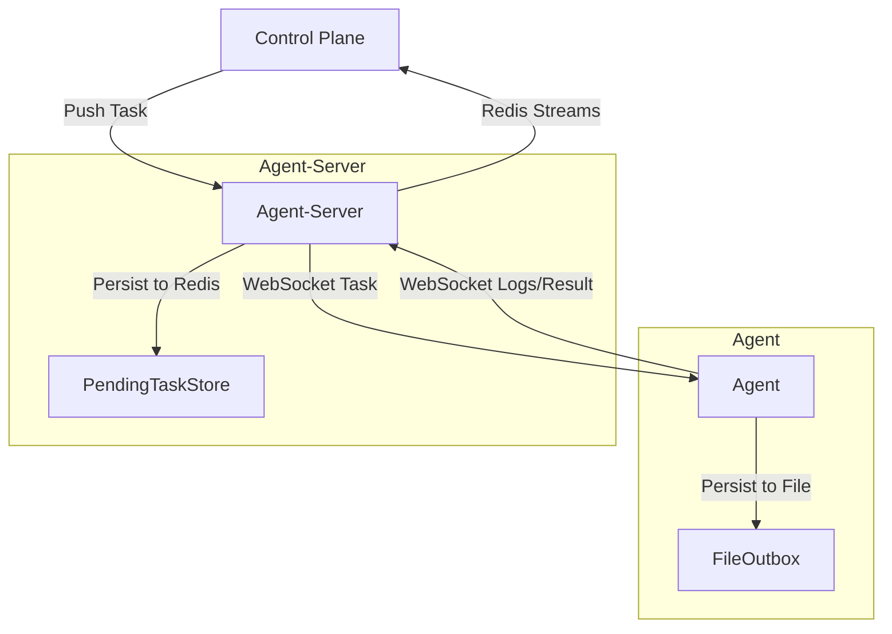

# OPS Job Agent (Go)

运维作业平台的 Agent 客户端，使用 Go 语言实现，参考蓝鲸和 codo 的 agent 设计思想。

## 功能特性

### 核心功能

- ✅ Agent 注册和心跳机制
- ✅ 脚本执行（支持 shell/python/powershell）
- ✅ 文件传输
- ✅ 任务取消机制
- ✅ 实时日志上报
- ✅ 系统信息收集（CPU、内存、磁盘等）
- ✅ 任务队列和并发控制（使用 semaphore 库）
- ✅ 自动重连和错误恢复
- ✅ 配置管理（使用 viper，支持配置文件和环境变量）
- ✅ 本地日志记录和轮转（使用 logrus + lumberjack）
- ✅ 统一错误码体系
- ✅ 资源限制（带宽限制）
- ✅ 性能监控和指标上报
- ✅ WebSocket 客户端（agent-server 模式）
- ✅ 存储管理
- ✅ 测试覆盖

### 技术栈

- **日志**: logrus + lumberjack（日志轮转）
- **配置**: viper（YAML/环境变量）
- **并发控制**: semaphore（信号量库）
- **HTTP 客户端**: resty
- **Web 框架**: gin

### 架构设计

#### 无状态架构 (Stateless Architecture)

Agent 采用**无状态设计**，不再依赖 Redis 或其他外部消息队列：

- **Outbox 模式**: 使用本地文件 (`FileOutbox`) 持久化待发送的消息。
- **WebSocket 通信**: 所有的任务下发、日志上报、状态变更都通过 WebSocket 通道进行。
- **Agent-Server 负责持久化**: 任务队列和 ACK 管理由 Agent-Server 负责，Agent 专注于任务执行。
- **断线恢复**: 如果 WebSocket 连接断开，消息会先保存在本地文件 (Outbox) 中，重连后自动补发。



#### 代码结构

```plaintext
agent-go/
├── cmd/agent/          # 主程序入口
├── internal/
│   ├── api/           # API 类型定义
│   ├── config/        # 配置管理（使用 viper）
│   ├── constants/     # 常量定义
│   ├── core/          # Agent 核心逻辑
│   │   ├── agent.go           # Agent 主逻辑
│   │   ├── model.go           # 数据模型
│   │   └── websocket_handler.go # WebSocket 处理
│   ├── errors/        # 错误处理
│   ├── executor/      # 任务执行器
│   │   ├── executor.go        # 基础执行器
│   │   ├── script_executor.go # 脚本执行器
│   │   ├── file_transfer.go   # 文件传输执行器
│   │   └── file_preview.go    # 文件预览
│   ├── httpclient/    # HTTP 客户端
│   ├── logger/        # 日志管理（使用 logrus + lumberjack）
│   ├── metrics/       # 性能监控和指标上报
│   ├── resource/      # 资源限制（带宽限制）
│   ├── server/        # HTTP 服务器（健康检查等）
│   ├── storage/       # 存储管理
│   ├── system/        # 系统信息收集
│   ├── taskqueue/     # 任务队列管理
│   └── websocket/     # WebSocket 客户端
│       ├── client.go          # WebSocket 客户端
│       ├── outbox.go          # 消息队列
│       └── protocol.go        # 协议定义
```

## 快速开始

### 安装依赖

```bash
cd agent/agent-go
go mod tidy
```

### 编译

```bash
go build -o .\bin\agent .\cmd\agent\main.go
```

### 配置

#### 方式1：环境变量（层级名）

```bash
export AGENT_CONNECTION_AGENT_SERVER_URL=wss://agent-server.example.com
export AGENT_CONNECTION_AGENT_SERVER_BACKUP_URL=wss://agent-server-backup.example.com
export AGENT_CONNECTION_WS_BACKOFF_INITIAL_MS=1000
export AGENT_CONNECTION_WS_BACKOFF_MAX_MS=30000
export AGENT_CONNECTION_WS_MAX_RETRIES=6
export AGENT_CONNECTION_WS_OUTBOX_MAX_SIZE=1000

export AGENT_IDENTIFICATION_AGENT_TOKEN=your-token-here
export AGENT_IDENTIFICATION_AGENT_NAME=my-agent
# 可选任务配置（使用层级名覆盖默认值）
export AGENT_TASK_HEARTBEAT_INTERVAL=10
export AGENT_TASK_MAX_CONCURRENT_TASKS=5
export AGENT_TASK_MAX_EXECUTION_TIME_SEC=7200

# Outbox 冲刷配置（可选，<=0 则使用默认/禁用）
export AGENT_LOGGING_LOG_BATCH_SIZE=200
export AGENT_LOGGING_LOG_FLUSH_INTERVAL=200

# 可选资源配置（当前仅带宽限制，单位 MB/s，0 为不限制）
export AGENT_RESOURCE_LIMIT_BANDWIDTH_LIMIT=0
```

#### 方式2：配置文件（YAML）

创建 `~/.ops-job-agent/config.yaml`:

```yaml
agent_server_url: "wss://agent-server.example.com"
agent_server_backup_url: "wss://agent-server-backup.example.com"
ws_backoff_initial_ms: 1000
ws_backoff_max_ms: 30000
ws_max_retries: 6
ws_outbox_max_size: 1000
agent_token: "your-token-here"
agent_name: "my-agent"
log_dir: "/var/log/ops-job-agent"
log_max_size: 10        # MB
log_max_files: 5
log_max_age: 7          # 天
# 任务配置
task:
  heartbeat_interval: 10   # 秒
  max_concurrent_tasks: 5
  max_execution_time_sec: 7200  # 秒
# 资源限制（带宽）
resource_limit:
  bandwidth_limit: 0    # MB/s，0 表示不限制
# 资源自适应（可选）
resource_adaptive:
  enabled: false
  sample_interval_sec: 5
  cpu_high: 75
  cpu_low: 55
  load_high_factor: 1.2
  load_low_factor: 0.8
  min_factor: 0.3
  step: 0.1
  cooldown_sec: 15
  min_bandwidth_mb: 1
# Outbox（离线/重连缓存）冲刷配置
logging:
  log_batch_size: 200          # 每批冲刷条数（<=0 回退默认 200）
  log_flush_interval: 200      # 冲刷间隔（毫秒，<=0 不启用周期冲刷）
```

### 运行

```bash
./ops-job-agent start
```

## 配置说明

| 环境变量（层级名）                           | 配置文件字段                       | 默认值                           | 说明                                        |
| -------------------------------------------- | ---------------------------------- | -------------------------------- | ------------------------------------------- |
| `AGENT_CONNECTION_AGENT_SERVER_URL`        | `agent_server_url`               | `ws://localhost:8080`          | Agent-Server WebSocket 入口（唯一传输通道） |
| `AGENT_CONNECTION_AGENT_SERVER_BACKUP_URL` | `agent_server_backup_url`        | ``                               | 备用 Agent-Server WS 入口                   |
| `AGENT_CONNECTION_WS_BACKOFF_INITIAL_MS`   | `ws_backoff_initial_ms`          | `1000`                         | WS 重连初始退避（毫秒）                     |
| `AGENT_CONNECTION_WS_BACKOFF_MAX_MS`       | `ws_backoff_max_ms`              | `30000`                        | WS 重连最大退避（毫秒）                     |
| `AGENT_CONNECTION_WS_MAX_RETRIES`          | `ws_max_retries`                 | `6`                            | WS 重试次数                                 |
| `AGENT_CONNECTION_WS_OUTBOX_MAX_SIZE`      | `ws_outbox_max_size`             | `2000`                         | WS 断线本地缓冲上限（条）                   |
| `AGENT_IDENTIFICATION_AGENT_TOKEN`         | `agent_token`                    | -                                | Agent 认证 Token                            |
| `AGENT_IDENTIFICATION_AGENT_NAME`          | `agent_name`                     | 主机名                           | Agent 名称                                  |
| `AGENT_LOGGING_LOG_DIR`                    | `log_dir`                        | `/tmp/ops-job-agent/logs`      | 日志目录                                    |
| `AGENT_LOGGING_LOG_MAX_SIZE`               | `log_max_size`                   | `10`                           | 日志文件最大大小（MB）                      |
| `AGENT_LOGGING_LOG_MAX_FILES`              | `log_max_files`                  | `5`                            | 最大保留日志文件数                          |
| `AGENT_LOGGING_LOG_MAX_AGE`                | `log_max_age`                    | `7`                            | 日志保留天数                                |
| `AGENT_TASK_HEARTBEAT_INTERVAL`            | `task.heartbeat_interval`        | `10`                           | 心跳间隔（秒，WS）                          |
| `AGENT_TASK_MAX_CONCURRENT_TASKS`          | `task.max_concurrent_tasks`      | `5`                            | 最大并发任务数                              |
| `AGENT_TASK_MAX_EXECUTION_TIME_SEC`        | `task.max_execution_time_sec`    | `7200`                         | 全局最大任务执行时间（秒）                  |
| `AGENT_LOGGING_LOG_BATCH_SIZE`             | `logging.log_batch_size`         | `200`                          | Outbox 每批冲刷条数（<=0 回退默认 200）     |
| `AGENT_LOGGING_LOG_FLUSH_INTERVAL`         | `logging.log_flush_interval`     | `200`                          | Outbox 冲刷间隔（毫秒，<=0 不启用周期冲刷） |
| `AGENT_RESOURCE_LIMIT_BANDWIDTH_LIMIT`     | `resource_limit.bandwidth_limit` | `0`                            | 带宽限制（MB/s，0 表示不限制）              |
| `AGENT_RESOURCE_ADAPTIVE_ENABLED`          | `resource_adaptive.enabled`      | `false`                        | 是否启用资源自适应                          |
| `AGENT_RESOURCE_ADAPTIVE_SAMPLE_INTERVAL_SEC` | `resource_adaptive.sample_interval_sec` | `5`                    | 采样间隔（秒）                              |
| `AGENT_RESOURCE_ADAPTIVE_CPU_HIGH`         | `resource_adaptive.cpu_high`     | `75`                           | CPU 高阈值（%）                             |
| `AGENT_RESOURCE_ADAPTIVE_CPU_LOW`          | `resource_adaptive.cpu_low`      | `55`                           | CPU 低阈值（%）                             |
| `AGENT_RESOURCE_ADAPTIVE_LOAD_HIGH_FACTOR` | `resource_adaptive.load_high_factor` | `1.2`                      | Load 高阈值系数（*CPU核数）                 |
| `AGENT_RESOURCE_ADAPTIVE_LOAD_LOW_FACTOR`  | `resource_adaptive.load_low_factor` | `0.8`                       | Load 低阈值系数（*CPU核数）                 |
| `AGENT_RESOURCE_ADAPTIVE_MIN_FACTOR`       | `resource_adaptive.min_factor`   | `0.3`                          | 动态因子最小值                              |
| `AGENT_RESOURCE_ADAPTIVE_STEP`             | `resource_adaptive.step`         | `0.1`                          | 动态因子调整步长                            |
| `AGENT_RESOURCE_ADAPTIVE_COOLDOWN_SEC`     | `resource_adaptive.cooldown_sec` | `15`                           | 调整冷却时间（秒）                          |
| `AGENT_RESOURCE_ADAPTIVE_MIN_BANDWIDTH_MB` | `resource_adaptive.min_bandwidth_mb` | `1`                        | 限速下限（MB/s）                            |
| `AGENT_CONFIG_FILE`                        | -                                  | `~/.ops-job-agent/config.yaml` | 配置文件路径                                |

**注意**: 环境变量优先级高于配置文件。

### 连接模式

- 仅支持 **agent-server** 模式：Agent 先通过 HTTP 注册到 Agent-Server，随后所有任务/心跳/日志/结果均通过单一 WebSocket 通道传输，消息必须带 `message_id` 并依赖 ACK/Outbox 做可靠投递，无 HTTP 回退通道。

## API 接口

Agent 与 Agent-Server/控制面通过以下方式交互（仅 WS 通道）：

- 注册（HTTP，仅一次）：`POST /api/agents/register/`
- WebSocket：`ws://agent-server:8080/ws/agent/{agent_id}`
  - **认证**：使用 `Sec-WebSocket-Protocol` 头部传递 token，格式：`agent-token,{agent_token}`
  - `type=task/tasks_batch`：任务下发
  - `type=cancel_task/cancel_tasks_batch`：取消任务
  - `type=heartbeat`：Agent 心跳（仅 WS）
  - `type=log`：日志上报（必须携带 `message_id`，ACK 后视为落盘）
  - `type=result`：任务结果上报（必须携带 `message_id`，ACK 后视为落盘）
  - `type=ack`：Agent-Server 对日志/结果的持久化确认
  - 无 HTTP/SSE 回退通道

## 任务类型

### 脚本执行

```json
{
  "id": "task-123",
  "name": "执行脚本",
  "type": "script",
  "script_type": "shell",
  "command": "#!/bin/bash\necho 'Hello World'",
  "timeout_sec": 300,
  "env": {
    "VAR1": "value1"
  }
}
```

### 文件传输

```json
{
  "id": "task-124",
  "name": "文件上传",
  "type": "file_transfer",
  "file_transfer": {
    "type": "upload",
    "remote_path": "/tmp/file.txt",
    "content": "base64_encoded_content"
  }
}
```

## 系统信息收集

Agent 会定期收集并上报以下系统信息：

- 主机名
- 操作系统和架构
- IP 地址列表
- CPU 使用率
- 内存使用率
- 磁盘使用率（各挂载点）
- 负载平均值（Unix）
- 系统运行时间

## 日志管理

使用 **logrus** + **lumberjack** 实现：

- 结构化日志（支持字段）
- 日志文件自动轮转（达到最大大小时）
- 保留指定数量的历史日志文件
- 自动压缩旧日志文件
- 同时输出到标准输出和日志文件
- 支持日志级别（Debug/Info/Warn/Error）

## 开发计划

- [X] WebSocket 实时日志推送
- [X] 资源限制（带宽限制）
- [X] 性能监控和指标上报
- [X] 无状态架构改造 (FileOutbox, 移除 Redis/Asynq)
- [ ] TLS 支持
- [ ] 插件系统

## 参考

- [蓝鲸标准运维](https://github.com/Tencent/bk-sops)
- [Codo](https://github.com/opendevops-cn/codo)
- [logrus](https://github.com/sirupsen/logrus)
- [lumberjack](https://github.com/natefinch/lumberjack)
- [viper](https://github.com/spf13/viper)
- [semaphore](https://github.com/marusama/semaphore)
