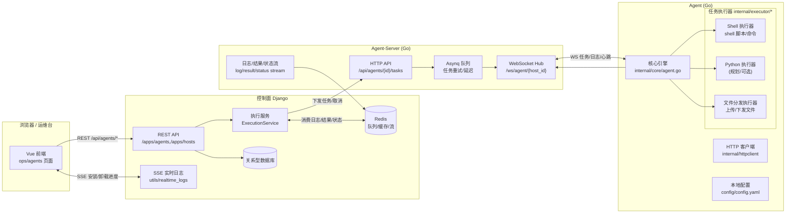
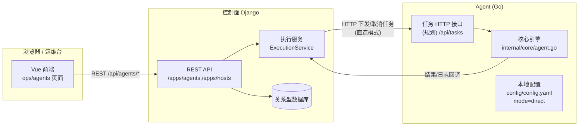
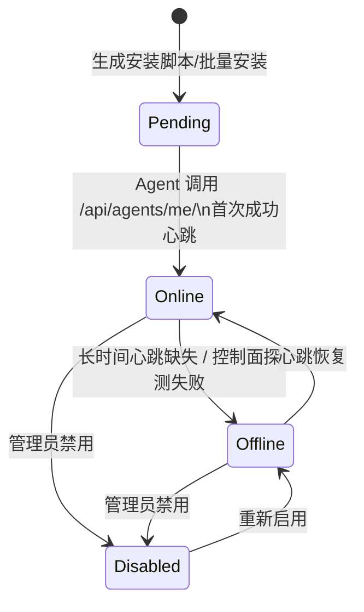
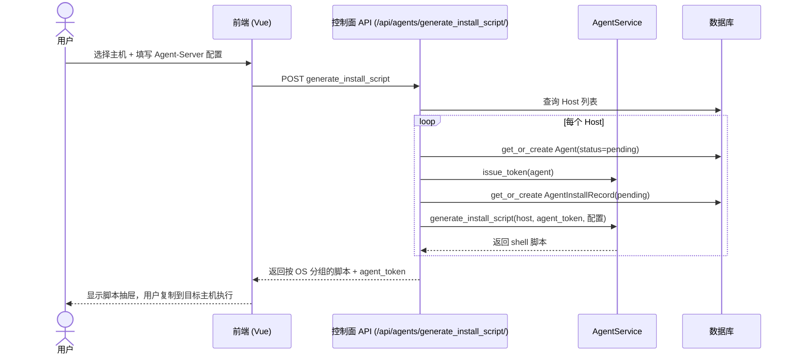
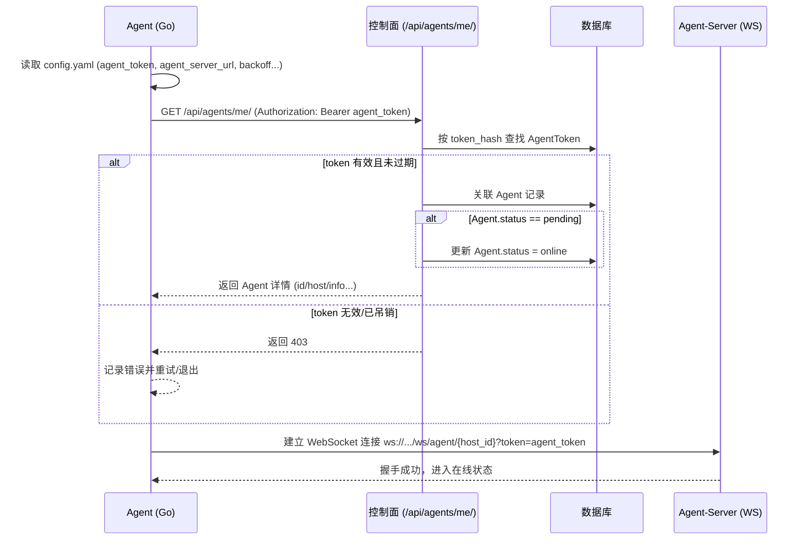
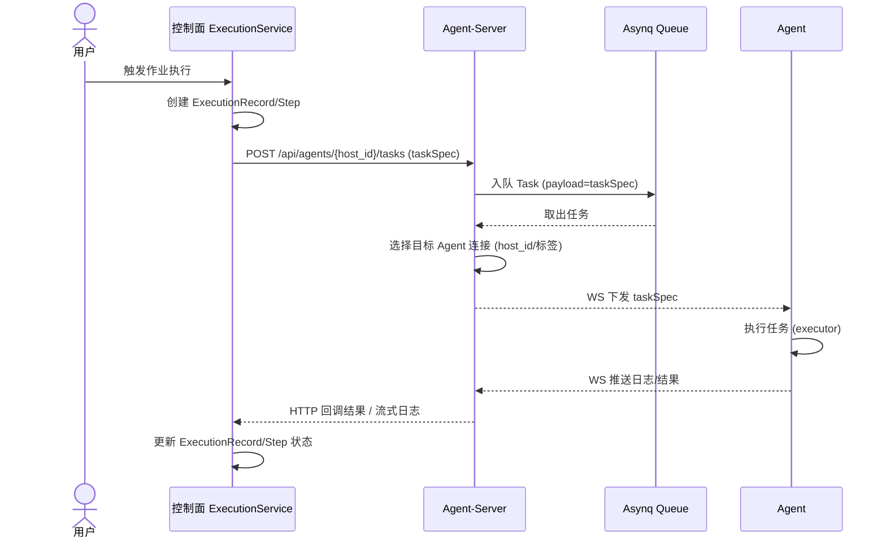
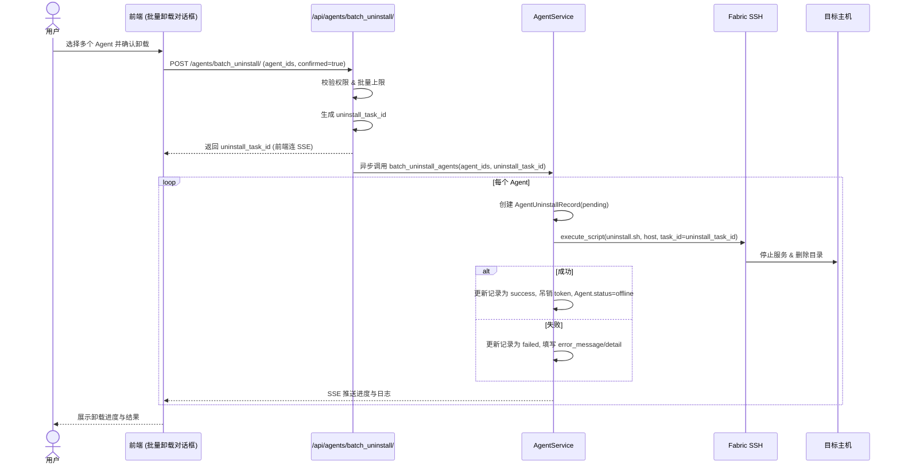

## Ops-Job Agent 总体架构说明（当前实现版本）

> 本文是控制面（Django）、Agent（Go）与 Agent-Server（Go）之间通信与生命周期的**唯一权威说明**，以当前代码实现为准：  
> - 控制面：`apps/agents/*`、`apps/hosts/*`、`apps/agents/execution_service.py`  
> - Agent：`agent/agent-go/*`  
> - Agent-Server：`agent/agent-server-go/*`

---

### 1. 总体拓扑与组件职责（双模式分层视图）

#### 1.1 经 Agent-Server 转发的模式（当前主模式）

#### 1.2 直连 Agent 的模式（规划 / 小规模场景）

> 直连模式用于少量节点、网络简单场景：控制面直接 HTTP 打到 Agent 暴露的任务接口，不经过 Agent-Server。  
> 该模式在当前代码中仅部分能力落地，图中用于帮助理解双模式整体架构。

**组件职责简述**：
- **控制面（CP）**：
  - 通过 DRF 提供 Agent 管理 API（安装、卸载、启用/禁用、批量操作）。
  - 维护 `Agent` / `AgentToken` / 安装记录 / 卸载记录等模型。
  - 提供 `/api/agents/me/` 供 Agent 首次上线获取自身 ID 并将状态从 `pending` 置为 `online`。
  - 通过 `ExecutionService` 将作业任务推送到 Agent-Server。
- **Agent-Server（AS）**：
  - 维护与各 Agent 的 WebSocket 连接。
  - 接收控制面下发任务，写入 Asynq 队列，调度并通过 WS 推送给 Agent。
  - 聚合日志/结果/状态并写入后端流（当前主要通过 HTTP 回传控制面；Redis Stream 集成在演进中）。
- **Agent（AG）**：
  - 启动后从 `config/config.yaml` 读配置，使用 `agent_token` 调用 `/api/agents/me/` 完成“激活”。
  - 建立到 Agent-Server 的 WebSocket 连接；持续上报心跳、日志与任务结果。
  - 本地执行脚本/文件/工作流任务，支持并发与取消（部分能力按文档 TODO 落地）。

---

### 2. 关键数据模型与状态机

#### 2.1 Agent 模型（控制面）

- `Agent`：
  - `host`：一对一绑定主机。
  - `status`：`pending` / `online` / `offline` / `disabled`。
  - `version`：Agent 二进制版本。
  - `endpoint`：接入点（当前主要是 Agent-Server URL）。
  - `active_token_hash`：当前有效的 Agent Token 哈希。
- `AgentToken`：
  - 仅存 hash，不落明文。
  - 记录签发人、过期时间、吊销时间等。

**状态机（简化）**：

- **Pending**：脚本已生成/已在主机执行，等待 Agent 首次上线。
- **Online**：最近心跳正常。
- **Offline**：一段时间未收到心跳。
- **Disabled**：显式禁用（不再下发任务，但 Agent 仍可上报状态）。

---

### 3. 安装脚本与 Agent 启动流程

#### 3.1 安装脚本生成（控制面）

- API：`POST /api/agents/generate_install_script/`
  - 请求：`host_ids[]`、`install_mode`（当前主要是 `agent-server`）、`agent_server_url` 及备份地址、WS 退避参数、指定包版本等。
  - 行为：
    1. 为每个主机关联/创建一个 `Agent(status='pending')`。
    2. 签发新的 `AgentToken`（吊销旧 token）。
    3. 创建/更新 `AgentInstallRecord`。
    4. 通过 `AgentService.generate_install_script` 根据包信息与配置生成 shell 脚本。

**时序图：生成安装脚本**

#### 3.2 Agent 启动与注册（当前 Scheme B）

- 安装脚本在目标主机上完成：
  - 下载 `ops-job-agent` 二进制。
  - 在 `$INSTALL_DIR/config/config.yaml` 写入：
    - `mode`、`agent_server_url` / `control_plane_url`。
    - 重连/退避参数。
    - `agent_token`。
  - 创建 systemd unit 并启动服务。

- Agent 启动逻辑（简化）：
  - 读取 `config.yaml`，获取 `agent_token` 与 Agent-Server URL。
  - 使用 `agent_token` 调用控制面：`GET /api/agents/me/`：
    - 校验 token 哈希是否有效。
    - 找到关联的 `Agent` 记录。
    - 如状态为 `pending`，更新为 `online`。
    - 返回 Agent 详情（包含 `id = host_id` 等）。
  - 建立到 Agent-Server 的 WebSocket 连接，开始心跳与任务循环。

**时序图：Agent 首次上线与激活**

---

### 4. 任务下发与结果回流（Agent-Server 模式）

> 下述流程基于 `agent_server_architecture` + `asynq_integration` + 当前 `apps/agents/execution_service.py` 实现。

#### 4.1 任务下发高层流程

1. 用户在作业平台发起执行。
2. 控制面创建 `ExecutionRecord` / `ExecutionStep` 等元数据。
3. 执行服务根据主机上的 Agent 配置信息确定使用 Agent-Server 模式。
4. 通过 HTTP 调用 Agent-Server：`POST /api/agents/{host_id}/tasks` 下发任务。
5. Agent-Server 将任务写入 Asynq 队列并调度到合适的 Agent 连接。
6. Agent 通过 WebSocket 接收任务，执行后通过 WS 上报日志与结果。
7. Agent-Server 将结果回传控制面（当前为 HTTP 回调，日志/状态后续统一流式化）。

**时序图：任务下发与执行**

---

### 5. 批量卸载与清理流程

> 对应新实现的 `POST /api/agents/batch_uninstall/` 与 `AgentService.batch_uninstall_agents`。

#### 5.1 批量卸载 API 行为

- 请求：`agent_ids[]`、`account_id`（可选 SSH 账号）、`confirmed`。
- 流程：
  1. 权限与批量上限校验（prod 环境更严格）。
  2. 生成 `uninstall_task_id`，异步执行卸载。
  3. 为每个 Agent 创建 `AgentUninstallRecord(status='pending')`。
  4. 构造幂等卸载脚本，通过 Fabric SSH 在对应主机执行：
     - 停止并禁用 `ops-job-agent` systemd 服务。
     - 删除 unit 文件并 `systemctl daemon-reload`。
     - 备份配置并删除 `/opt/ops-job-agent`。
  5. 更新 `AgentUninstallRecord` 状态为 `success/failed`。
  6. 尝试吊销 token，设置 Agent 状态为 `offline`。
  7. 通过 SSE 推送卸载进度与日志到前端。

**时序图：批量卸载**

---

### 6. 前端视图与操作能力（概览）

- `ops/agents/index.vue`：
  - Agent 列表 + 状态筛选（pending/online/offline/disabled）。
  - 统计卡片：总数、在线、离线、待激活、禁用。
  - 单个 Agent：
    - 查看安装脚本（pending 状态）。
    - 重新生成脚本（通过安装记录或 Agent 详情）。
    - 删除（仅 pending）。
  - 批量操作：
    - 批量安装（SSH）。
    - 批量重新生成脚本（pending）。
    - 批量删除 pending。
    - 批量卸载（SSH）+ SSE 进度。
- 安装/卸载记录页面：
  - `GET /api/agents/install_records/`。
  - `GET /api/agents/uninstall_records/`。
